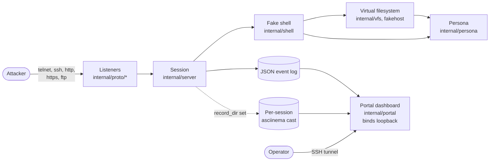
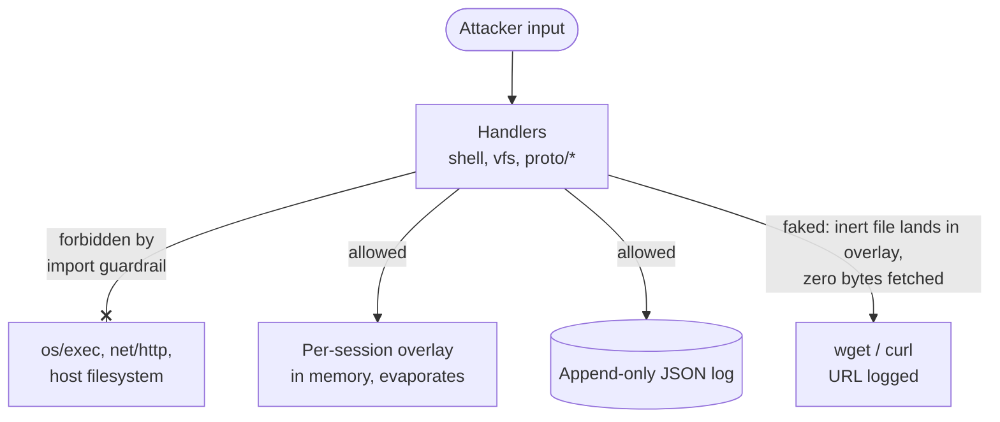
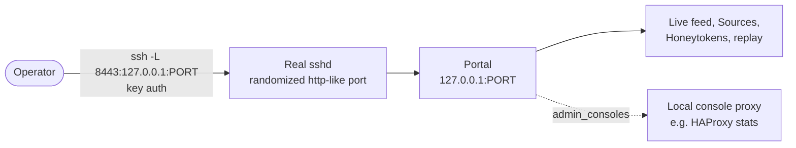

# SweeTTY: Architecture

One Go binary. It listens on many ports, presents a fake Linux service on each, records every interaction as JSON, and serves that log to a loopback dashboard. Read [`VISION.md`](./VISION.md) for why; this is how the pieces fit.

## Data flow

Every connection runs through the same accept loop and lands as structured events the portal reads back.

The persona is generated once per instance and drives every identity-bearing output (banners, `uname`, `/etc/*`, the prompt), so they cannot disagree. The virtual filesystem backs every file command, so a listing and a read can never contradict each other.

## The safety boundary

The packages that handle attacker input cannot reach the means to break out. An import guardrail ([`internal/safety`](./internal/safety)) enforces this structurally and fails the build when it is violated, so it holds by construction.

A download is logged and faked: an inert file lands in the per-session overlay so it appears to succeed, but not a byte is fetched from the network. A file an attacker creates lives in that same overlay and never touches the host disk. Nothing the attacker sends is executed. The deception is allowed to *look* like success (installs finish, persistence sticks, exfil reports done) precisely because none of it crosses this boundary.

## The management plane

The portal has no network footprint. It binds loopback and serves the dashboard over plain HTTP with no application auth. The operator reaches it by forwarding the box's real management SSH (itself on a randomized, http-like port) to the loopback portal, so SSH key auth is the single front door.

